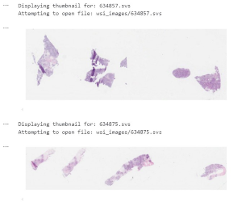

# py-wsi-digital-pathology

## Project Overview

The Jupyter notebook wsi_svs_thumbnails.ipynb displays thumbnails of whole slide .svs images (WSI) discussed within the Nature publication "Multi-omic machine learning predictor of breast cancer therapy response".

## Installation Instructions

1. **Update the package list:**
    ```bash
    sudo apt update
    ```

2. **Install the required packages:**
    ```bash
    sudo apt-get install libopenslide0 openslide-tools
    ```
    ```bash
    sudo apt-get install libjpeg-dev zlib1g-dev
    ```

3. **Install the Python dependencies:**
    ```bash
    pip install -r requirements.txt
    ```

4. **Download the training and validation datasets from 
   [Zenodo](https://zenodo.org/records/6337925).**

5. **Run the Jupyter notebook:**
    Open and run `wsi_svs_thumbnail.ipynb` using Jupyter Notebook.

## Outputs



## Test Environments

* GitHub Codespaces
* Google Colab
* Python 3.12.1

## License

Dataset Information
This project utilizes a digital pathology (histology) dataset consisting of .svs files. The dataset is sourced from the research article "[Multi-omic machine learning predictor of breast cancer therapy response]" (DOI: 10.5281/zenodo.6337925).

The dataset is licensed under a Creative Commons Attribution 4.0 International license (CC BY 4.0).